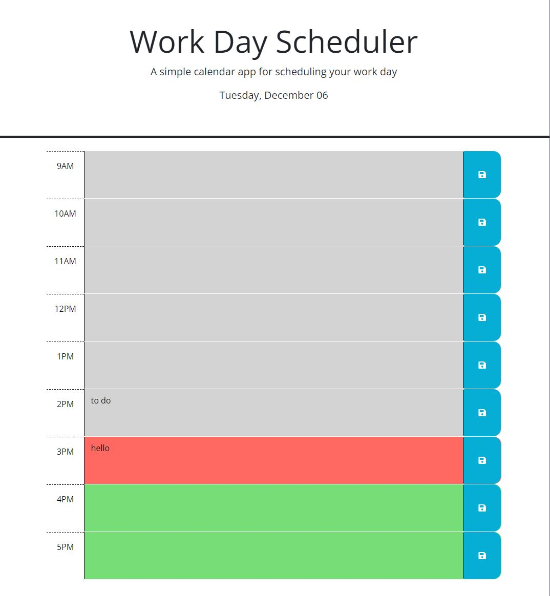

# Work Day Scheduler

## Description

Using jQuery and Day.js, this application saves the text input for each hour block of the work day. When the page is loaded, today's date is displayed at the top of the page and hours of the work day are from 9AM - 5PM. The current hour's hour block will be red, the future will be green and the past will be gray.

## Installation

N/A

## Usage
Github: https://github.com/michelletrn/workday-tracker-challenge.git
Deployed URL: https://michelletrn.github.io/workday-tracker-challenge/

Here is a screenshot of my application:

## Credits

N/A

## License

N/A
